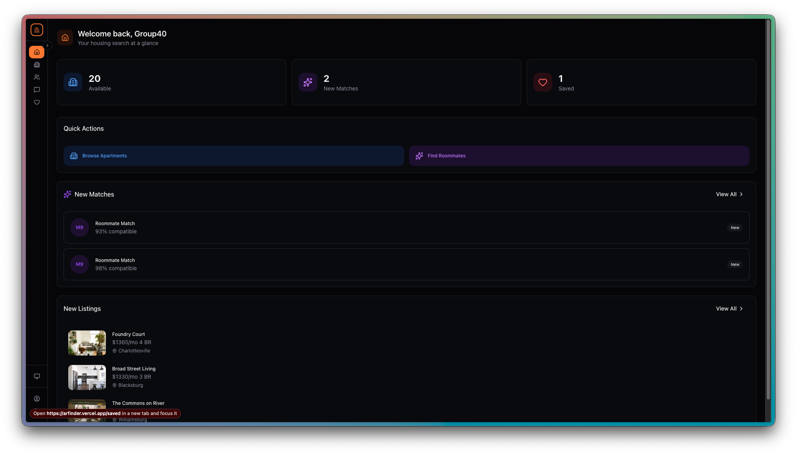
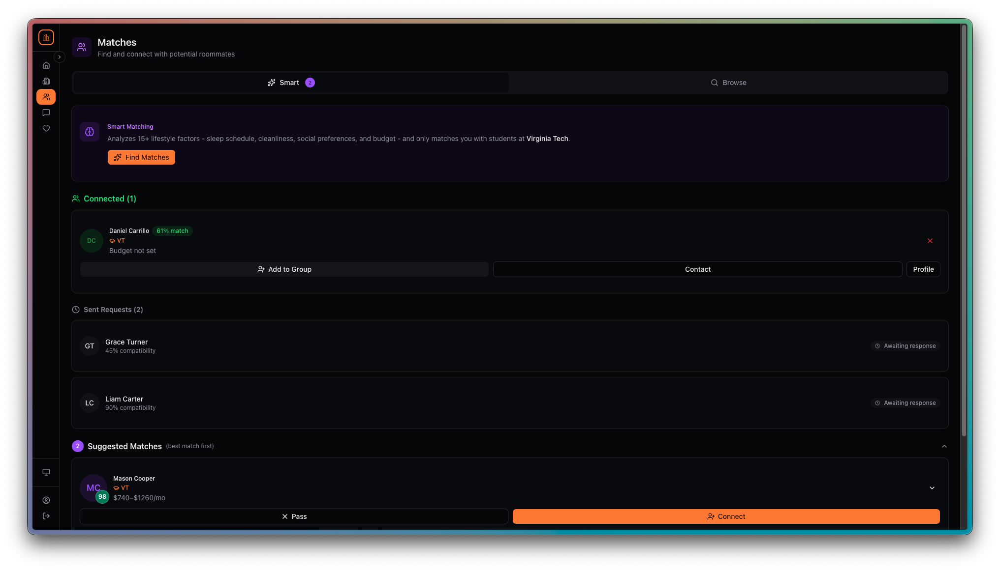
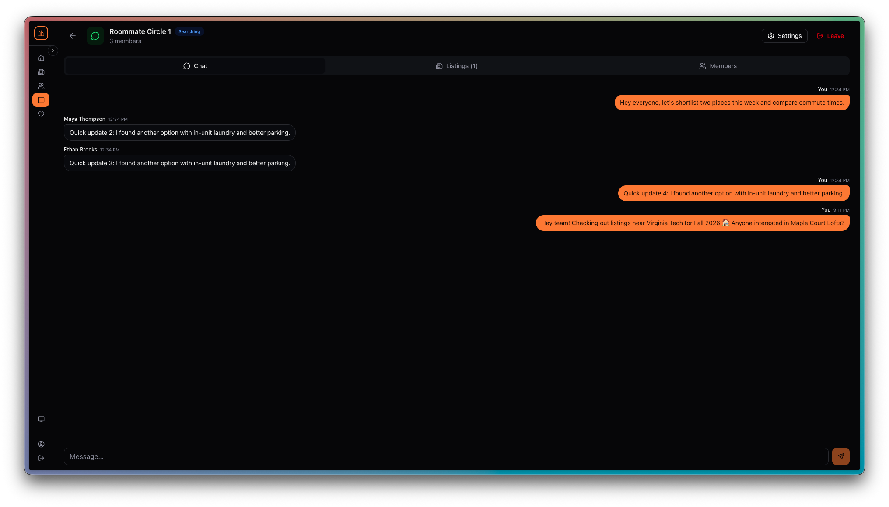
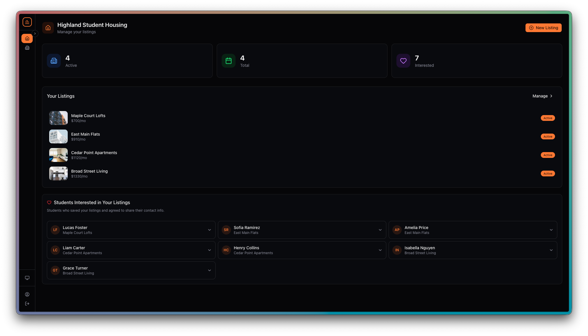
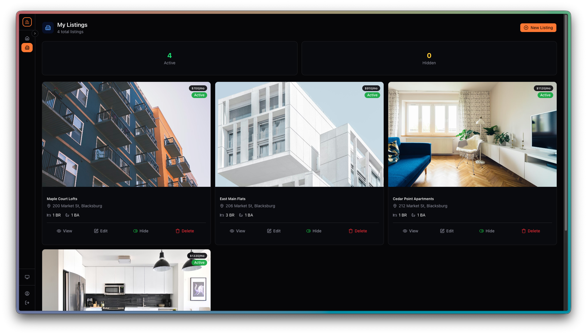
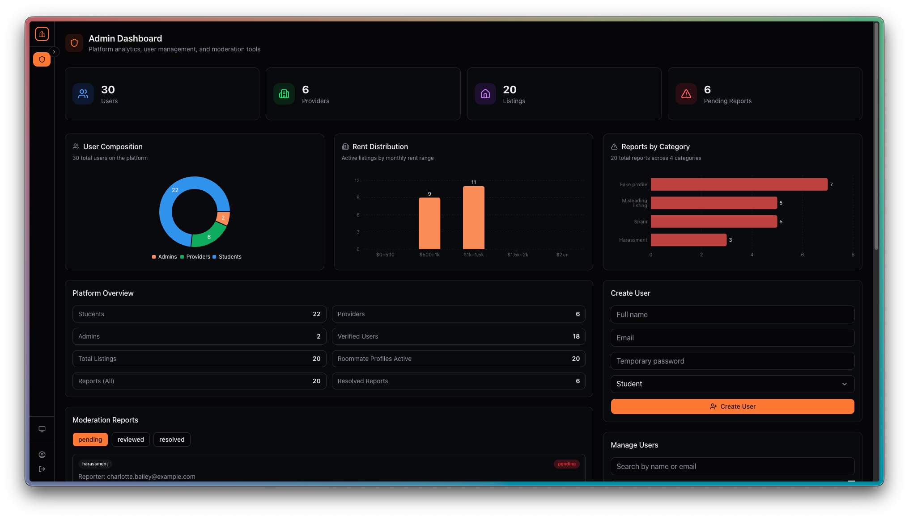

<p align="center">
  
</p>

<h1 align="center">A&R Finder</h1>

<p align="center">
  <strong>Apartment &amp; Roommate Finder for University Students</strong><br/>
  <em>CS 4604 — Group 40 &nbsp;|&nbsp; Virginia Tech &nbsp;|&nbsp; Spring 2026</em>
</p>

<p align="center">
  
  
  
  
  
</p>

---

## Table of Contents

- [Introduction](#introduction)
- [Key Features](#key-features)
- [Application Screenshots](#application-screenshots)
- [Tech Stack](#tech-stack)
- [Architecture Overview](#architecture-overview)
- [Database Design](#database-design)
- [Repository Structure](#repository-structure)
- [Getting Started](#getting-started)
  - [Prerequisites](#prerequisites)
  - [Environment Variables](#environment-variables)
  - [Installation & Local Development](#installation--local-development)
- [Demo Login Credentials](#demo-login-credentials)
- [Quality Checks & Testing](#quality-checks--testing)
- [Production Build & Deployment](#production-build--deployment)
- [Team & Roles](#team--roles)

---

## Introduction

A&R Finder (Apartment and Roommate Finder) is a **full-stack, database-driven web application** designed to help university students find off-campus housing and compatible roommates. The platform addresses a common challenge in student housing: relevant information is typically scattered across social media, group chats, and informal networks, making it difficult to compare options and identify suitable living arrangements.

By centralizing housing listings and roommate profiles into a single system, A&R Finder gives students a more organized, reliable, and collaborative approach to the housing search process.

---

## Key Features

### For Students
| Feature | Description |
|---|---|
| **Smart Roommate Matching** | Algorithm-driven compatibility scoring based on lifestyle preferences (sleep schedule, cleanliness, noise tolerance, budget, social habits). Scores break down into six weighted dimensions. |
| **AI-Powered Insights** | Optional GPT-enhanced match explanations that summarize why two students are compatible (powered by OpenAI API). |
| **Apartment Browsing** | Paginated, filterable apartment feed with search by title/address/city, price range, bedrooms, bathrooms, pet policy, utilities, parking, amenities, availability date, and college affiliation. |
| **Saved Listings** | Bookmark apartments for later review with a dedicated saved-listings page. |
| **Roommate Groups** | Create or join groups with matched roommates to collaboratively search for housing — share listings, vote on options, and chat in real-time within the group. |
| **Group Listing Votes** | Members can vote "interested," "neutral," or "not interested" on shared listings, with comments. |
| **Profile Management** | Comprehensive profile editor for student info, roommate preferences, lifestyle details, contact methods, and profile photos. |
| **Onboarding Flow** | Guided step-by-step onboarding for new students and providers to set up their profiles immediately after registration. |

### For Apartment Providers
| Feature | Description |
|---|---|
| **Listing Management** | Full CRUD for apartment listings with image uploads, amenity tags, external links, lease details, and multi-college targeting. |
| **Provider Dashboard** | Overview of active/inactive listings, total saves, and interested students at a glance with analytics charts. |
| **Interested Students** | View which students have saved their listings (with consent-based visibility). |

### For Admins
| Feature | Description |
|---|---|
| **Admin Dashboard** | Platform-wide analytics — user counts by role, listing stats, report trends, and recent activity with interactive charts (bar + pie). |
| **User Management** | Browse all users, view detailed profiles, and inspect user data. |
| **Report Moderation** | Review, resolve, and manage user-submitted reports targeting listings or users. |

### Cross-Cutting
| Feature | Description |
|---|---|
| **Role-Based Access Control** | Three roles (student, provider, admin) with server-side enforcement on all write operations. |
| **Authentication** | Email/password auth via Better Auth with role-aware sign-in. |
| **Dark/Light/System Theme** | Full theme support persisted to user settings. |
| **Responsive Design** | Mobile-first layout with collapsible sidebar navigation. |
| **Real-Time Data** | Convex reactive queries keep all views up to date without manual refresh. |
| **Contact Privacy** | Granular contact visibility controls — users decide what to share and with whom. |
| **Reporting System** | Report users or listings for moderation review. |
| **Notifications** | Toast-based notifications for matches, group activity, and system events. |

---

## Application Screenshots

### Student Dashboard
> Personalized overview with stat cards (available apartments, new matches, saved count), quick actions, new match alerts with compatibility scores, and latest listing previews.

<p align="center">
  
</p>

### Roommate Matching
> Smart matching with compatibility percentages, connected/sent/suggested tabs, AI-powered insights, and actions to connect, add to groups, or view full profiles.

<p align="center">
  
</p>

### Roommate Groups
> Real-time group chat with tabs for Chat, Listings, and Members. Groups coordinate housing searches — share listings, vote on options, and message in one place.

<p align="center">
  
</p>

### Provider Dashboard
> Listing management overview with active/inactive counts, total interested students, listing directory, and a view of students who have saved your properties.

<p align="center">
  
</p>

### Provider Listings
> Card grid of all provider listings with images, rent, location, bedrooms/bathrooms, and actions to view, edit, hide, or delete each listing.

<p align="center">
  
</p>

### Admin Dashboard
> Platform-wide analytics with user composition donut chart, rent distribution bar chart, reports by category, platform overview stats, moderation reports queue, and user management tools.

<p align="center">
  
</p>

### ER Diagram (Phase 4 — UML)
<p align="center">
  
</p>

---

## Tech Stack

| Layer | Technology |
|---|---|
| **Frontend** | [Next.js 16](https://nextjs.org/) (App Router) + [React 19](https://react.dev/) + TypeScript |
| **Styling** | [Tailwind CSS 4](https://tailwindcss.com/) + [shadcn/ui](https://ui.shadcn.com/) + [Radix UI](https://www.radix-ui.com/) |
| **Backend & Database** | [Convex](https://convex.dev/) (reactive database + serverless functions) |
| **Authentication** | [Better Auth](https://www.better-auth.com/) via `@convex-dev/better-auth` |
| **Charts** | [Recharts](https://recharts.org/) |
| **AI (optional)** | OpenAI GPT API for roommate match insights |
| **Deployment** | [Vercel](https://vercel.com/) (frontend) + Convex Cloud (backend) |
| **Icons** | [Lucide React](https://lucide.dev/) |
| **Notifications** | [Sonner](https://sonner.emilkowal.dev/) |

---

## Architecture Overview

```
┌─────────────────────────────────────────────────────────┐
│                      Client (Browser)                    │
│  Next.js 16 App Router  ·  React 19  ·  Tailwind CSS    │
│  shadcn/ui  ·  Convex React hooks  ·  Better Auth client │
└────────────────────────┬────────────────────────────────┘
                         │  Real-time subscriptions
                         │  + HTTP API (auth)
                         ▼
┌─────────────────────────────────────────────────────────┐
│                    Convex Cloud Backend                   │
│                                                          │
│  ┌──────────┐  ┌──────────┐  ┌───────────┐  ┌────────┐ │
│  │ Queries  │  │Mutations │  │  Actions   │  │  HTTP  │ │
│  │(reactive)│  │(writes)  │  │(side-fx)   │  │ routes │ │
│  └──────────┘  └──────────┘  └───────────┘  └────────┘ │
│          │            │            │              │       │
│          ▼            ▼            ▼              ▼       │
│  ┌─────────────────────────────────────────────────────┐ │
│  │              Convex Document Database                │ │
│  │    18 tables · Indexed · Validated · Paginated      │ │
│  └─────────────────────────────────────────────────────┘ │
│                                                          │
│  ┌─────────────┐  ┌──────────────┐  ┌────────────────┐  │
│  │ Better Auth │  │ File Storage  │  │ OpenAI Action  │  │
│  │ (component) │  │  (images)     │  │ (GPT insights) │  │
│  └─────────────┘  └──────────────┘  └────────────────┘  │
└─────────────────────────────────────────────────────────┘
```

---

## Database Design

The data model follows **3NF-oriented relational design** principles, adapted for Convex's document database. The schema comprises **18 tables** organized into these domains:

| Domain | Tables |
|---|---|
| **Core Identity** | `users`, `contactInfo`, `userPhotos` |
| **Reference Data** | `colleges` |
| **Role Profiles** | `studentProfiles`, `providerProfiles`, `roommateProfiles` |
| **Listings** | `apartmentListings`, `listingImages`, `savedListings` |
| **Matching** | `roommateMatches` |
| **Collaboration** | `roommateGroups`, `groupMembers`, `groupMessages`, `groupSharedListings`, `groupListingVotes` |
| **Moderation** | `reports` |
| **Settings** | `userSettings` |

**Key design decisions:**
- Identity is separated from role-specific attributes to maintain normalization
- Colleges are in a reference table, linked by ID to avoid duplication
- Contact records and photos are decomposed into child tables for one-to-many modeling
- Group collaboration uses independent relation tables for clean querying
- Indexes cover auth lookups, ownership queries, high-frequency listing access, and uniqueness-by-contract paths
- Constraints are enforced via Convex validators + shared runtime validators in `convex/validation.ts`
- Paginated endpoints prevent unbounded reads on browse workloads
- Referential integrity is maintained by `convex/dataIntegrity.ts` (audit + repair)

> Full documentation: [`database-design.md`](database-design.md)  
> Canonical schema: [`convex/schema.ts`](convex/schema.ts)

---

## Repository Structure

```
cs4604-group40-application/
├── frontend/                  # Next.js application
│   ├── app/
│   │   ├── page.tsx           # Auth page (sign-in / sign-up)
│   │   ├── layout.tsx         # Root layout, providers, metadata
│   │   ├── globals.css        # Tailwind + custom theme variables
│   │   ├── components/        # Shared UI components
│   │   │   ├── Sidebar.tsx        # Navigation sidebar (role-aware)
│   │   │   ├── Onboarding.tsx     # Multi-step onboarding wizard
│   │   │   ├── ListingCard.tsx    # Apartment card component
│   │   │   ├── ListingForm.tsx    # Create/edit listing form
│   │   │   ├── DatabaseViewer.tsx # Admin live DB browser
│   │   │   ├── RoommateProfileView.tsx # Match profile display
│   │   │   └── ...
│   │   ├── (authenticated)/   # Protected routes (require auth)
│   │   │   ├── dashboard/     # Role-specific dashboards
│   │   │   ├── apartments/    # Browse + detail pages
│   │   │   ├── roommates/     # Match browse + detail pages
│   │   │   ├── groups/        # Group list, detail, creation
│   │   │   ├── my-listings/   # Provider listing management
│   │   │   ├── saved/         # Saved listings page
│   │   │   ├── profile/       # User profile editor
│   │   │   ├── settings/      # Privacy & notification settings
│   │   │   └── admin/         # Admin user detail views
│   │   ├── api/auth/          # Better Auth HTTP route handler
│   │   └── db/                # Client DB utilities
│   ├── components/ui/         # shadcn/ui component library
│   ├── lib/                   # Auth context, types, utilities
│   └── public/                # Static assets (images, ER diagrams)
├── convex/                    # Backend (Convex)
│   ├── schema.ts              # Canonical database schema (18 tables)
│   ├── domain.ts              # Shared validators & enums
│   ├── validation.ts          # Runtime validation helpers
│   ├── lib.ts                 # Auth helpers & role guards
│   ├── users.ts               # User CRUD & lookup
│   ├── studentProfiles.ts     # Student profile operations
│   ├── providerProfiles.ts    # Provider profile operations
│   ├── roommateProfiles.ts    # Roommate profile operations
│   ├── apartmentListings.ts   # Listing queries & mutations
│   ├── listingImages.ts       # Image upload/management
│   ├── savedListings.ts       # Bookmark operations
│   ├── roommateMatches.ts     # Match scoring & status
│   ├── gptMatching.ts         # GPT-powered match insights
│   ├── gptMatchingHelpers.ts  # Match data preparation
│   ├── groups.ts              # Group CRUD & membership
│   ├── groupMessages.ts       # Group chat
│   ├── groupSharedListings.ts # Shared listings & voting
│   ├── colleges.ts            # College reference data
│   ├── contactInfo.ts         # Contact method CRUD
│   ├── userPhotos.ts          # Photo upload/ordering
│   ├── userSettings.ts        # Privacy & preference settings
│   ├── reports.ts             # Moderation reports
│   ├── admin.ts               # Admin queries & mutations
│   ├── dataIntegrity.ts       # Audit & repair functions
│   ├── seed.ts                # Seed data & demo accounts
│   ├── http.ts                # HTTP route configuration
│   └── betterAuth/            # Auth component integration
├── diagrams/                  # ER diagrams (Phase 2, 3, 4)
├── docs/                      # database-design.md - Full data model documentation
├── reports/                   # Phase reports (PDF submissions)
├── roles/                     # Team member role descriptions
├── tests/                     # Unit tests
│   ├── validation.test.ts     # Validation helper tests
│   └── lib-normalization.test.ts  # Normalization tests
├── package.json               # Dependencies & scripts
├── vercel.json                # Deployment configuration
├── eslint.config.mjs          # Linting configuration
└── .gitignore
```

---

## Getting Started

### Prerequisites

| Requirement | Version |
|---|---|
| **Node.js** | 20 or higher |
| **npm** | 10 or higher |
| **Convex account** | Free at [convex.dev](https://convex.dev/) |

### Environment Variables

Create a `.env.local` file in the project root (never committed — covered by `.gitignore`).

#### Required (runtime)

```env
# Convex connection
NEXT_PUBLIC_CONVEX_URL=https://your-deployment.convex.cloud
CONVEX_SITE_URL=https://your-deployment.convex.site

# App URL
SITE_URL=http://localhost:3000

# Auth secret (generate a random 32+ char string)
BETTER_AUTH_SECRET=your-secret-key-here
```

#### Recommended

```env
NEXT_PUBLIC_APP_URL=http://localhost:3000
# Fallback: NEXT_PUBLIC_SITE_URL=http://localhost:3000
```

#### Optional (feature-specific)

```env
# Enables GPT-enhanced roommate match insights
OPENAI_API_KEY=sk-...

# Only for the seed script's admin account creation
DEFAULT_ADMIN_PASSWORD=Admin12345!

# Used for seed safety checks
CONVEX_DEPLOYMENT=your-deployment-name
```

### Installation & Local Development

**1. Clone the repository**

```bash
git clone https://github.com/your-org/cs4604-group40-application.git
cd cs4604-group40-application
```

**2. Install dependencies**

```bash
npm install
```

**3. Set up Convex**

If this is a fresh setup, initialize your Convex project:

```bash
npx convex dev
```

This will:
- Prompt you to log in to Convex (if not already authenticated)
- Create/link a Convex deployment
- Push the schema and functions
- Start the Convex development server

**4. Set up environment variables**

Copy the required variables from [Environment Variables](#environment-variables) into `.env.local`. The `NEXT_PUBLIC_CONVEX_URL` will be displayed when you run `npx convex dev`.

**5. Seed the database (optional but recommended)**

The seed script creates demo colleges, users, profiles, listings, matches, and groups:

```bash
npx convex run seed:seedAll
```

This populates the database with realistic demo data including the test accounts listed in [Demo Login Credentials](#demo-login-credentials).

**6. Start the development server**

```bash
npm run dev
```

The application will be available at **[http://localhost:3000](http://localhost:3000)**.

> **Note:** You need the Convex development server running in parallel. Either run `npx convex dev` in a separate terminal, or use the combined dev workflow if your project is configured for it.

---

## Demo Login Credentials

These accounts are created by the seed script and are available for role-based testing:

| Role | Email | Password |
|---|---|---|
| **Student** | `group40@user.com` | `User12345!` |
| **Provider** | `group40@provider.com` | `Provider12345!` |
| **Admin** | `group40@admin.com` | `Admin12345!` |

> When signing in, select the matching role (Student / Provider / Admin) on the login page before entering credentials.

---

## Quality Checks & Testing

All four quality gates pass cleanly:

```bash
# Lint the entire codebase (frontend, tests, convex)
npm run lint

# TypeScript type checking with strict mode
npm run typecheck

# Run unit tests (validation & normalization)
npm run test

# Run all checks sequentially
npm run check
```

| Check | Command | Status |
|---|---|---|
| ESLint | `npm run lint` | Passing |
| TypeScript | `npm run typecheck` | Passing |
| Unit Tests | `npm run test` | 5/5 passing |
| All | `npm run check` | Passing |

---

## Production Build & Deployment

### Build locally

```bash
npm run build
```

If Turbopack is unstable in your environment:

```bash
npm run build:webpack
```

### Start production server

```bash
npm run start
```

### Vercel deployment

The project includes a `vercel.json` with:
- Next.js framework detection
- Webpack build command (for stability)
- Security headers (`X-Content-Type-Options`, `X-Frame-Options`, `Referrer-Policy`)

Deploy by connecting the repository to [Vercel](https://vercel.com/) and setting the environment variables in the Vercel dashboard.

---

## Team & Roles

| Name | Primary Responsibilities |
|---|---|
| **Hursh Soni** | Data model design, frontend UI/UX, auth-aware views, roommate matching, project coordination |
| **Anthony Osei** | Core backend (Convex queries/mutations), auth flows, server-side validation, phase deliverables |
| **Daniel Carrillo** | Database design & refinement, technical specs, testing, data integrity, ERD documentation |
| **Vivan Verma** | Backend co-ownership, frontend components, integration testing, role-based flow verification |
| **Generative AI** | Feature implementation support, seed data generation, debugging, architecture suggestions, documentation |

---

<p align="center">
  <sub>Built with Next.js, React, Convex, and Tailwind CSS for CS 4604 at Virginia Tech.</sub>
</p>
